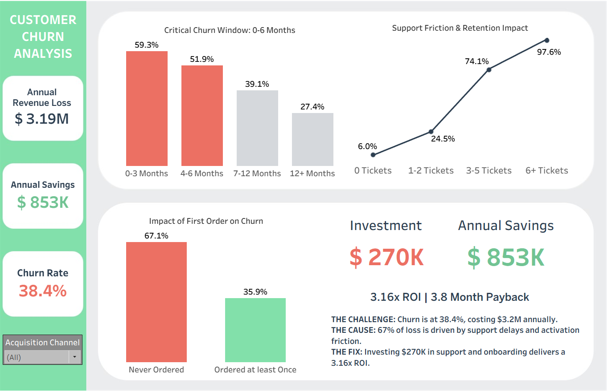

# 📊 Strategic Customer Churn & ROI Analysis
**Data-Driven Retention Strategy to Recover $853K in Annualized Revenue**

## 🎯 Executive Summary
Customer churn has reached **38.4%** (vs. 25–30% benchmark), resulting in a **$3.2M annual revenue loss**. This analysis of 8K customers and 16.6K interactions confirms that the crisis is driven by operational support friction and failed early customer activation. By investing **$270K** in targeted improvements, the organization can achieve a **3.16x ROI** with a **3.8-month payback period**.

---

## 🖼️ Dashboard Preview

> **[🔗 View Interactive Dashboard on Tableau Public](https://public.tableau.com/views/Strategic_Retention_ROI_Dashboard/Dashboard3?:language=en-US&:sid=&:redirect=auth&:display_count=n&:origin=viz_share_link)**

---

## 💡 Key Business Insights
* **The Support "Death Spiral":** Customers with 6+ support tickets churn at **97.6%**, indicating severe friction in the resolution process.
* **Resolution Speed Impact:** Slow response times (48hr+) drive an **82.1% churn rate**, a 4.3x increase over fast resolution (<24hr).
* **The 0-6 Month Risk Window:** **59.3% of churn** occurs within the first 90 days of the customer lifecycle.
* **Activation Failure:** Customers who never place an order churn at **67.1%**; early activation within 14 days is the strongest predictor of long-term loyalty.

## 🛠️ Technical Implementation
* **SQL:** Performed complex data engineering including **CTE-based cohort analysis**, **LOD simulations** for first-order dates, and **financial scenario modeling**.
* **Tableau:** Developed a high-fidelity executive dashboard utilizing **Level of Detail (LOD) expressions**, custom color palettes for accessibility, and interactive parameters for "What-If" analysis.

## 📂 Repository Structure & Documentation
I’ve documented the entire end-to-end process across the following directories:
* **[/Dashboard](./Dashboard):** Packaged Tableau Workbook (.twbx).
* **[/Data](./Data):** Cleaned dataset used for the analysis.
* **[/SQL_Scripts](./SQL_Scripts):** Documented queries for segmentation and ROI calculations.
* **[/Documentation](./Documentation):** [Full Executive Summary](./Documentation/EXECUTIVE_SUMMARY.md) and detailed business reports.

## 🚀 Recommendations
1. **Support Intervention ($165K):** Hire 3 specialized agents to maintain sub-24hr resolution and implement priority flagging for high-risk segments.
2. **Activation Program ($105K):** Deploy automated email/SMS sequences and a 20% first-order incentive to drive engagement within the "Golden Window".

---
**Contact:** [Tanay Ravindra
---
**Contact:** [Tanay Jujarao](www.linkedin.com/in/tanay-jujarao-8499a8255) | Data Analyst | Business Intelligence
